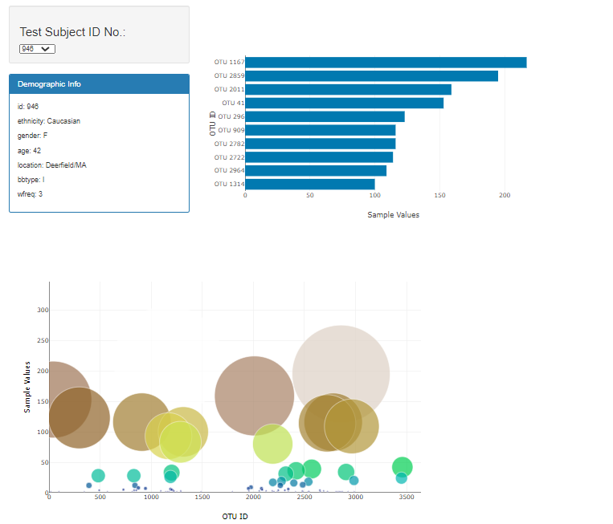

# plotly-challenge

In this assignment, I built an interactive dashboard to explore the Belly Button Biodiversity dataset, which catalogs the microbes that colonize human navels.

Landing page:

Interactive button to select participant id:

Plots

